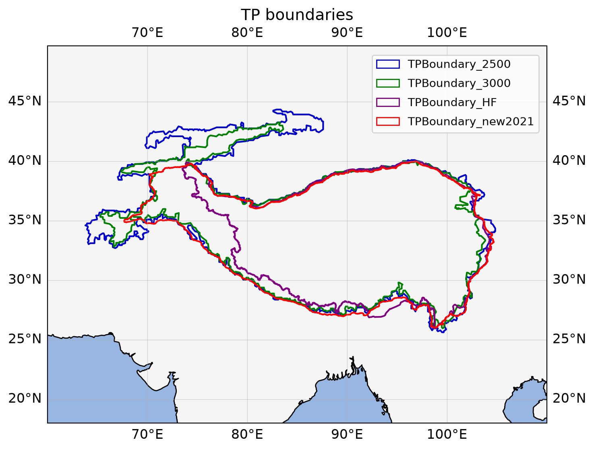
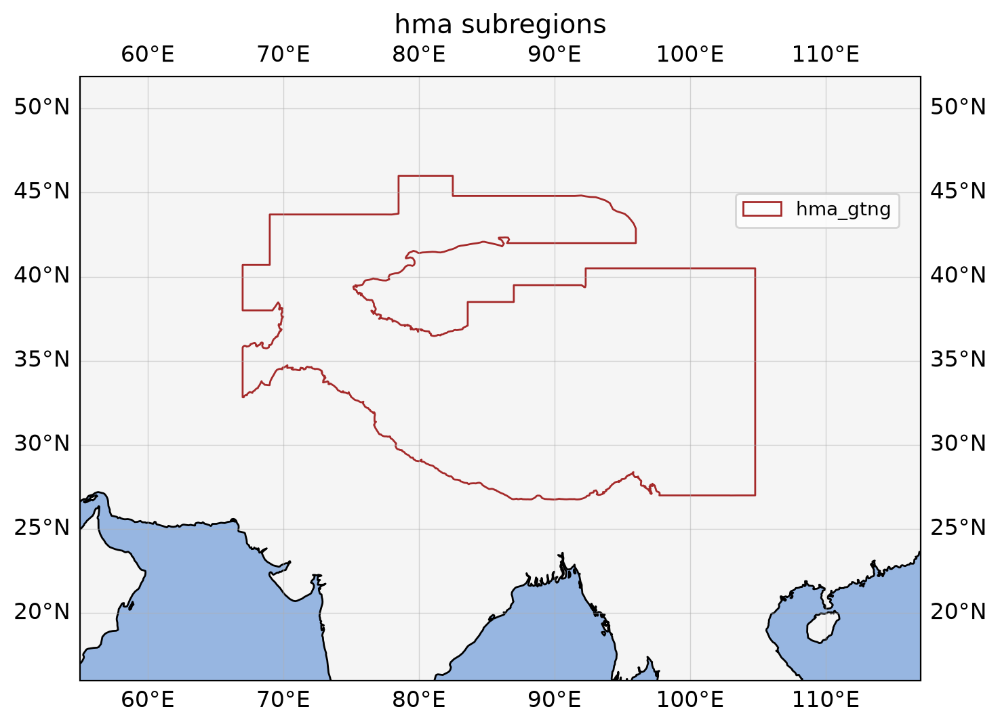
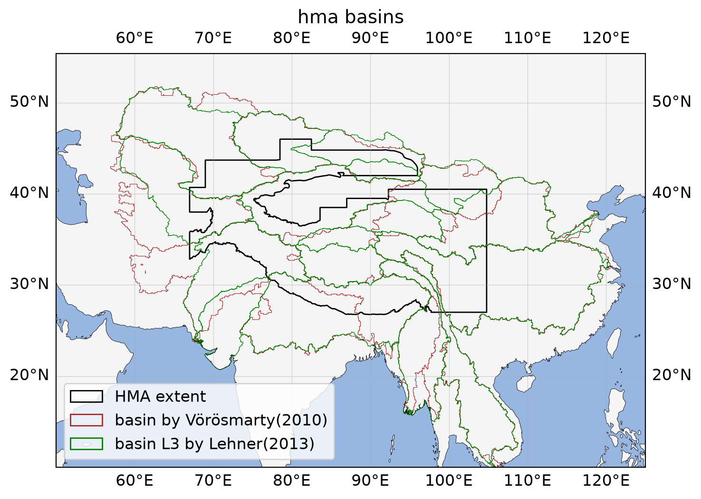
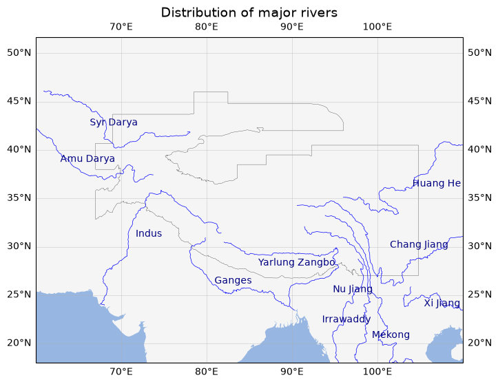
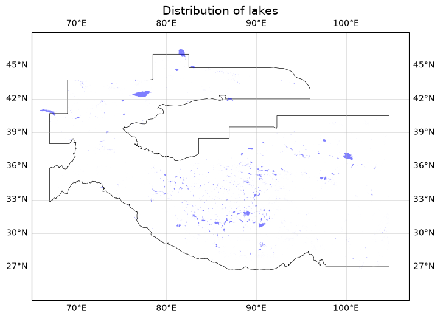
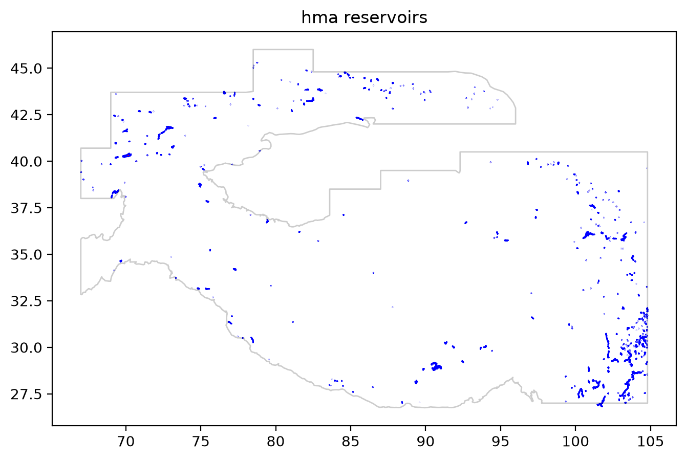
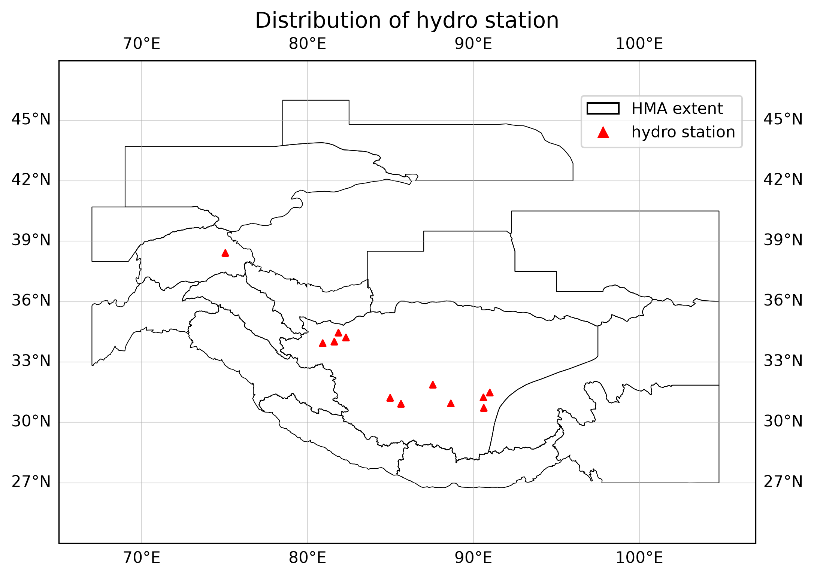

## Water in High Mountain Asia

### Objective:

Improve the understanding of the surface water(lake/river, water level/area) in HMA region.

## 1. Extents

### 1.1. Tibet extents

TPBoundary_2500, TPBoundary_3000, TPBoundary_HF and TPBoundary_ New.References:

1. Zhang, Y., Ren, H., Pan, X. (2019). Integration dataset of Tibet Plateau boundary. National Tibetan Plateau Data Center, DOI: 10.11888/Geogra.tpdc.270099. CSTR: 18406.11.Geogra.tpdc.270099. (Data citation)
2. Zhang, Y.L., Li, B.Y., Zheng, D. (2002). A discussion on the boundary and area of the tibetan plateau in china. Geographical Research.
3. Zhang, Y.L., Li, B.Y., Liu, L.S., Zheng, D. (2021). Redetermine the region and boundaries of Tibetan Plateau. GEOGRAPHICAL RESEARCH, 40(6), 1543-1553.
   

### 1.2. HMA extents (with glacier subregions)

1) Overview of the HMA extents in different researches.
   

#### 1.2.1. hma_subregions_brun2017

References:

1) Brun F, Berthier E, Wagnon P, et al. A spatially resolved estimate of High Mountain Asia glacier mass balances from 2000 to 2016[J]. Nature geoscience, 2017, 10(9): 668-673.

#### 1.2.2. hma_subregions_bolch2019

References:

1) Bolch T, Shea J M, Liu S, et al. Status and change of the cryosphere in the extended Hindu Kush Himalaya region[M]. The Hindu Kush Himalaya Assessment. Springer, Cham, 2019: 209-255.

#### 1.2.3. hma_subregions_gtng_2023

References:

1) GTN-G. GTN-G Glacier Regions. 2023. doi:10.5904/gtng-glacreg-2023-07.
2) Link: [https://www.mountcryo.org/datasets/](https://www.mountcryo.org/datasets/)

#### 1.2.4. Pan-Tibetan Highlands (hma) extents

(Comprising 4 subregions: Tibetan Plateau, Himalaya, Hengduan Mountains and Mountains of Centra Asia)References:

1. Liu J, Milne R I, Zhu G F, et al. Name and scale matters: Clarifying the geography of Tibetan Plateau and adjacent mountain regions[J]. Global and Planetary Change, 2022: 103893.

## 2. Basins

### 2.1. Hydrologic basin with 6 min spatial resolution on Asia

References:

1. Vörösmarty, C. J., McIntyre, P. B., Gessner, M. O., Dudgeon, D., Prusevich, A., Green, P., et al. (2010). Global threats to human water security and river biodiversity. Nature 467, 555–561. doi: 10.1038/nature09440
2. Shean D E, Bhushan S, Montesano P, et al. A systematic, regional assessment of high mountain Asia glacier mass balance[J]. Frontiers in Earth Science, 2020, 7: 363.

### 2.2. Hydrologic basins from level1-level6 by Lehner and Grill (2013)

Reference:

1. Lehner, B., Grill G. (2013). Global river hydrography and network routing: baseline data and new approaches to study the world’s large river systems. Hydrological Processes, 27(15): 2171–2186.
   

## 3. Rivers

### 3.1. Major rivers in HMA

Source: World Band Group
References:

1. download from: [https://datacatalog.worldbank.org/search/dataset/0042032](https://datacatalog.worldbank.org/search/dataset/0042032).
   

## 5. Lakes

### 5.1 HydroLakes dataset

Reference:

1. Messager, M.L., Lehner, B., Grill, G., Nedeva, I., Schmitt, O. (2016). Estimating the volume and age of water stored in global lakes using a geo-statistical approach. Nature Communications, 7: 13603. [https://doi.org/10.1038/ncomms13603](https://doi.org/10.1038/ncomms13603)
   

## 6. Reservoirs

### 6.1 Global Dam Watch (GDW) dataset

References

1. Mulligan M, Lehner B, Zarfl C, et al. Global Dam Watch: curated data and tools for management and decision making[J]. Environmental Research: Infrastructure and Sustainability, 2021, 1(3): 033003.
   

## 7. ground observation

### 7.1 ground-based observation locations

#### TODO:

(1, sun) data access for the hma region (data_down/4_rsimg_down_gee_TODO.ipynb).
(2, dou) save validation/lake_height/lake_station_lakes_all as .nc data (merge preproc/validation/1_1_lake_station_loc.ipynb and preproc/validation/1_2_lake_station_merge.ipynb into one). Data structure like:

station (dimensions)
────────────────────────────
station_id    0       1       2
name          A站     B站     C站
lon           102.7   100.2   98.5
lat           25.0    25.6    27.1

observation(variables)
────────────────────────────
station_index   time          water_level
0               2020-01-01    12.31
0               2020-01-02    12.28
0               2020-01-03    12.35
1               2018-03-01     8.42
1               2018-03-05     8.51
2               2022-01-01    15.21
...
then revise the data reading code in notebooks/validation/1_dahiti_hydroweb_validate.ipynb, and check the applicability of this code in cross-validation between dahiti and hydroweb.
